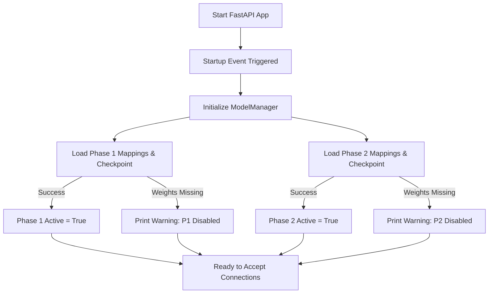
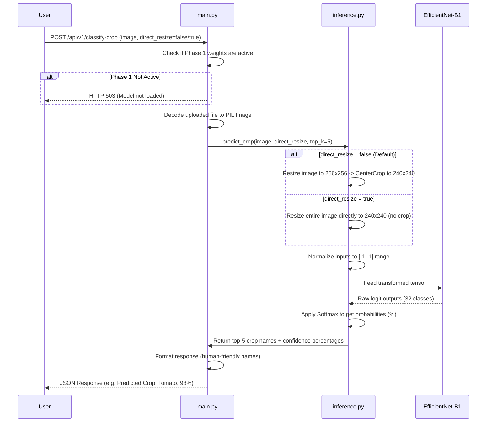
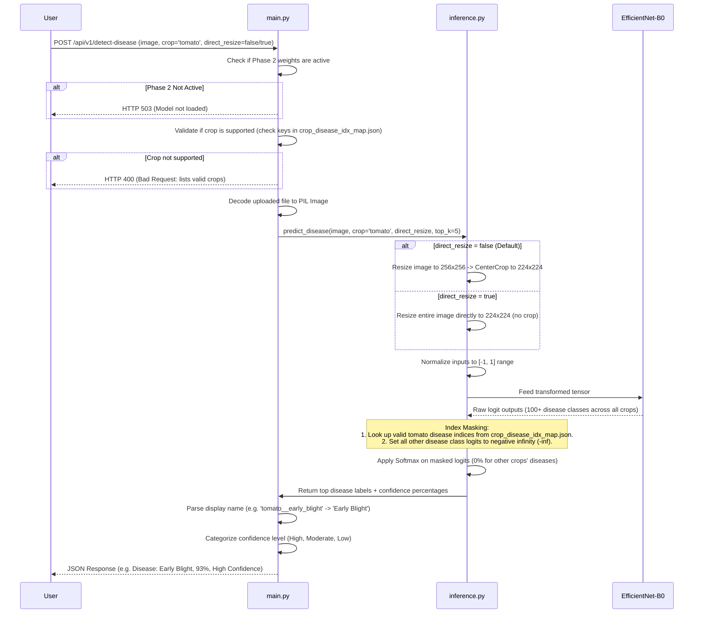

## 1. Directory Structure

To keep the system simple and easy to maintain, we used a flat, modular directory structure:

```text
disease_detection_v2/
├── weights/                          # Stores ML models and class maps
│   ├── class_to_idx_phase1.json      # Phase 1 crop name -> index mapping
│   ├── efficientnet_b1_crop_mini.pt  # Phase 1 model weights (EfficientNet-B1)
│   ├── crop_disease_idx_map.json     # Phase 2 crop name -> valid disease index list
│   └── efficientnet_b0_disease_mini.pt # Phase 2 model weights (EfficientNet-B0)
├── main.py                           # FastAPI configuration and endpoints routing
├── inference.py                      # Model loading, image transforms, and prediction logic
├── requirements.txt                  # Python dependencies
└── README.md                         # Project documentation and execution instructions
```

---

## 2. Startup Flow

When you run `uvicorn main:app --reload`:



* **Graceful Degradation**: If model weights are missing, the server does **not** crash. It starts up normally and logs a warning. If a client attempts to call an endpoint whose weights aren't loaded, they receive a clean `HTTP 503 Service Unavailable` response with setup instructions.

---

## 3. Phase 1: Crop Classification Flow

Called via `POST /api/v1/classify-crop`:



---

## 4. Phase 2: Disease Detection Flow (Masked Inference)

Called via `POST /api/v1/detect-disease`:

